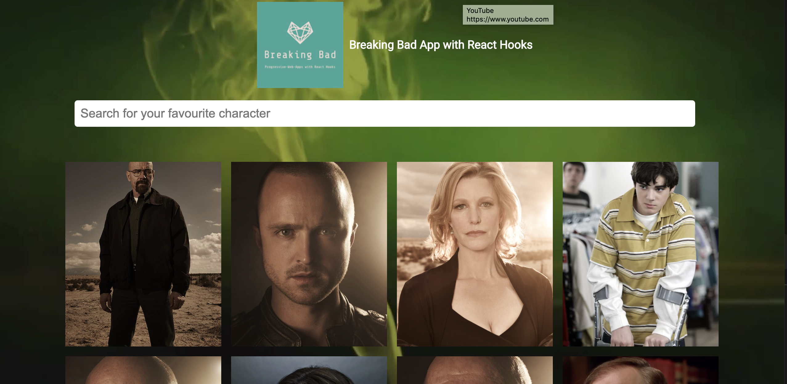

# React 16 & 17

Breaking Bad Repo: Demo deployed on Netifly: [https://happy-brown-985f49.netlify.app]

This is a set of tutorials to augment knowledge of React from basic concepts to advanced concepts such as PWAs and Hooks.

**React-2016** Focuses on class-based components to understand how react works from its early inception and to work on repos that may have a mix of class and functional components
**React-Hooks** Looks at migration or co-existance of class components to/with hooks
**PWAs** How PWAs work with continuous integration/build and deploy (Breaking Bad and Videorama)

**Work-in-Progress** This is a work in progress (Feb 2023) adding state-management concepts and demos to the repo

See the docs folder for guide-rails and further learning resources - You Tube videos and all the other reading I have done to debug and compile this demo app.

## Table of Contents

1. (Pre-requisites)[##Pre-requisites]
2. (Repo access)[##Repo-access]
3. (Scripts)[##Scripts]
4. (Linked-in certifications)[###Linked-in-certifications]

## Pre-requisites

Knowledge of React, GitHub (version control), code editors and working in a mono-repo

1. Node
   version >= 14 or above (which can be checked in the CLI (command line interface) byrunning `node -v`). You can use nvm for managing multiple Node versions on a single machine installed (check with `npm -v`)

- If node not already installed on your PC/Mac install [https://nodejs.org/en/download/]

2. Lerna
   This repo's packages are managed with Lerna Package manager with is dependent on Node global installation.

3. GitHub account

- GitHub account - link to clone repo [https://github.com/SumiSastri/react-basics-to-hooks]

## Repo access

To access this repo clone the repo and install dependencies:
`npm install - y` (node modules)
`npm audit fix` (clean up)

Once the repo is cloned run `npx lerna bootstrap` in the root folder - the package manager will add all dependencies to all folders in the repo

**CRA**

This project was bootstrapped with CRA [Create React App](https://github.com/facebook/create-react-app).

`npx create-react-app <yourAppName>`

**TypeScript**

`npx create-react-app my-nameofapp --typescript` (with CRA)

OR

`npm install typescript @types/node @types/react @types/react-dom` (with individual related types for react and react-dom)

With typescript note the `tsconfig` file
Node modules will now have the typescript files
File extensions can now be changes to `.tsx` not `.ts` as required

## Scripts

cd into `packages/folder-name` eg: cd `packages/videorama` and `npm run start` the front-end of that repo will run on `localhost:3000`

### Linked-in certifications

1. Learning React
2. React Building Progressive Apps
3. React Creating and Hosting a FullStack site
4. React State Management
