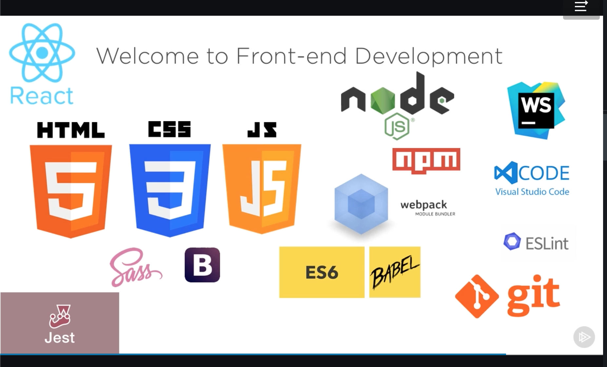

# Table of Contents

1. [Project access](#Project-access)
2. [Project goals](#Project-goals)
3. [Certifications](#Certifications)
4. [Resources](#RESOURCES)

# Requirements

- Node (latest LTM version)
  Node.js version >= 14 or above. You can use nvm for managing multiple Node versions on a single machine installed
- GitHub account
- Add React Dev Tools to Chrome (or browser that supports React Dev Tools)
- A code editor - VS Code used for these projects.

**Ensure Node is installed**

In terminal check if you have node and which version - if not install it

`node -v`
`npm -v`

Make a new folder
`mkdir my-nameofapp`

Change directory to the new folder created
`cd my-nameofapp`

Initialize it with node modules

`npm init`

This creates a new `package.json` file to store your project's dependencies installed via npm.

The fastest way to scaffold any react project is with the Create React App (CRA) site generator. This will generate a fully-functional React app with many common features built-in like Babel, Webpack, Jest, and a hot reloading development server. For react tables CRA has been installed with all the dependencies for this project.To add typescript `npx create-react-app my-nameofapp --typescript`

Wait for installation to be completed and cd into your app or clone this repo

# Project access

You can access this repo clone the repo and install dependencies:
`npm install - y`

Clone Repo: https://github.com/SumiSastri/react-basics-to-hooks.git

**Install dependencies**

cd (change directory) from the root directory - react-basics-to-hooks - into the repo you want to access

- breaking bad
- react-2016-class-components
- react-2019-hooks
- cd react-pwas/videorama-demo

`npm install -y`

If any audit issues run
`npm audit fix`

If you get the warning: `Greetings, time traveller. We are in the golden age of prefix-less CSS, where Autoprefixer is no longer needed for your stylesheet.`

update the project with the latest react-scripts - run this command in the repo

`npm install react-scripts@latest`

**Scripts**

`npm run start`

Access project scripts - debugging if you have incompatibility issues with es-lint/

1. Check if node_modules/eslint is outside your project directory - npm has issues with package hoisting - Try running npm ls eslint in your project folder to see where it is - This will tell you which other package (apart from the expected react-scripts) installed eslint.

-The files in these folders are outside the project directory you can

1. Delete package-lock.json
2. Delete node modules
3. Remove es-lint from dependencies/ dev-dependencies
4. run `npm install -y`
5. You can also try `npm uninstall eslint` and then `npm run start`

Note: If nothing else helps, add SKIP_PREFLIGHT_CHECK=true to an .env file in your project. **I have chosen this option as I am not using this folder to deploy or run a production build.**
That would permanently disable this preflight check in case you want to proceed anyway.

Note: Ensure that gitignore file is set up. If it is not create the dot file

`touch .gitignore`

Add this code to the file and save

```
# See https://help.github.com/articles/ignoring-files/ for more about ignoring files.

# dependencies
/node_modules
/.pnp
.pnp.js

# testing
/coverage

# production
/build

# misc
.DS_Store
.env.local
.env.development.local
.env.test.local
.env.production.local

npm-debug.log*
yarn-debug.log*
yarn-error.log*

```

# Project goals

The Breaking Bad progressive web app is the key project that applies the knowledge of React, React Hooks and Progressive Web-Apps. It has been deployed on Netifly [https://happy-brown-985f49.netlify.app]

The project as a whole follows a set of Linked-in learning tutorials with their excercises.

# Certifications

1. Learning React
2. React Building Progressive Apps
3. React Creating and Hosting a FullStack site
4. React State Management

Key folders for code base

- [Breaking Bad]()
  Project following YouTube tutorial to experiment with Hooks

- [Fundamentals]()
  Tutorials on the fundamentals of React, follows the basic and intermediate documentation with examples and code snippets. This has a front-end which demos many concepts and has a brief explaination of how the code works. There are readme's in each section to drill down into the documentation and simplify it. There is a mini-project on the Context-API following a tutorial from NetNinja. The project helped me understand how the documentation could be applied to a real project. This section uses class-based react-components.

- [Hooks]()

Work in Progress: Tutorials on the fundamentals of Hooks, follows the basic and intermediate documentation with examples and code snippets.

- [Progressive-Web-Apps-Videorama]()

  In the subfolder Videorama is a fully deployed app on Netifly, following a Linked-In course. This course has also been used to adapt the Breaking-Bad project and turn it into a PWA.

#### RESOURCES

The content of this repo has come from several references this lists some of the key resources I have used.

Tutorials:
Plural Sight: React the Big Picture : Cory House
Plural Sight: Designing React Components: Peter Kellner
Code: [https://github.com/pkellner/pluralsight-designing-react-components-course-code]

YouTube: React-2016 and React-Hooks examples come from this tutorial
CodeEvolution: https://www.youtube.com/playlist?list=PLC3y8-rFHvwgg3vaYJgHGnModB54rxOk3

Testing:
Plural Sight: Testing React Components: Liam McLennan
Plural Sight: Test-driven Development Using React:Chris Minnick
Plural Sight: Testing React Applications with Jest: Daniel Stern
Code [https://github.com/danielstern/isomorphic-react]

NetNinja best YouTube tute for testing: https://www.youtube.com/watch?v=7dTTFW7yACQ
GitHub Repo NetNinja Testing: [https://github.com/harblaith7/React-Testing-Library-Net-Ninja/tree/main/src]
Traversy Media very high-level overview: [https://www.youtube.com/watch?v=OVNjsIto9xM]
Academind - JavaScript testing(not specifically React): [https://www.youtube.com/watch?v=r9HdJ8P6GQI]
MPJ - Fun-Fun Functions[https://www.youtube.com/watch?v=Eu35xM76kKY] Too long and waffly

Documentation:
React
[https://reactjs.org/docs/getting-started.html]

Hooks
[https://reactjs.org/docs/hooks-intro.html][https://reactjs.org/docs/hooks-overview.html]

Cheat sheets from docs
[https://reactjs.org/docs/hooks-reference.html]

& FAQs - this one is really useful to understand why Hooks and benefits of using Hooks
[https://reactjs.org/docs/hooks-faq.html]

React Testing Library:
[https://testing-library.com/docs/]

# Getting Started with Create React App

This project was bootstrapped with [Create React App](https://github.com/facebook/create-react-app).

## Available Scripts

In the project directory, you can run:

### `npm start`

Runs the app in the development mode.\
Open [http://localhost:3000](http://localhost:3000) to view it in the browser.

The page will reload if you make edits.\
You will also see any lint errors in the console.

### `npm test`

Launches the test runner in the interactive watch mode.\
See the section about [running tests](https://facebook.github.io/create-react-app/docs/running-tests) for more information.

### `npm run build`

Builds the app for production to the `build` folder.\
It correctly bundles React in production mode and optimizes the build for the best performance.

The build is minified and the filenames include the hashes.\
Your app is ready to be deployed!

See the section about [deployment](https://facebook.github.io/create-react-app/docs/deployment) for more information.

### `npm run eject`

**Note: this is a one-way operation. Once you `eject`, you can’t go back!**

If you aren’t satisfied with the build tool and configuration choices, you can `eject` at any time. This command will remove the single build dependency from your project.

Instead, it will copy all the configuration files and the transitive dependencies (webpack, Babel, ESLint, etc) right into your project so you have full control over them. All of the commands except `eject` will still work, but they will point to the copied scripts so you can tweak them. At this point you’re on your own.

You don’t have to ever use `eject`. The curated feature set is suitable for small and middle deployments, and you shouldn’t feel obligated to use this feature. However we understand that this tool wouldn’t be useful if you couldn’t customize it when you are ready for it.

## Learn More

You can learn more in the [Create React App documentation](https://facebook.github.io/create-react-app/docs/getting-started).

To learn React, check out the [React documentation](https://reactjs.org/).
